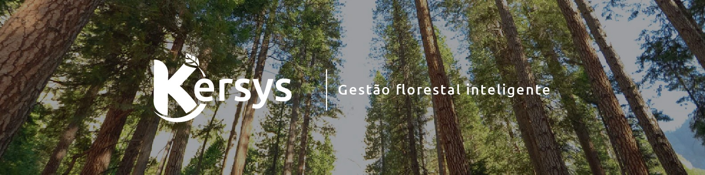
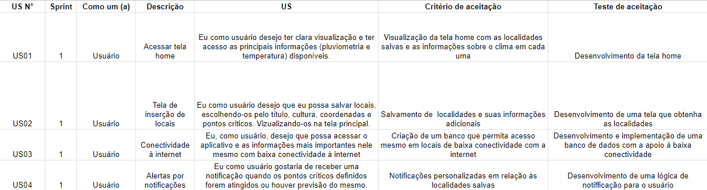
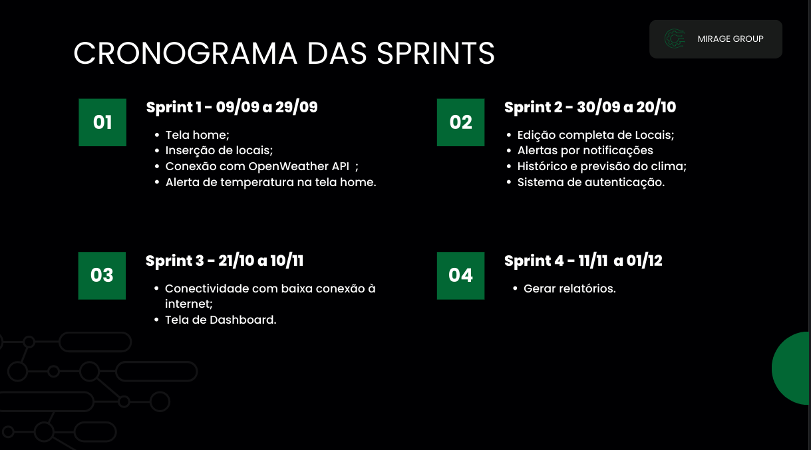

 
    <a href="#desafios-do-projeto">Desafios do Projeto</a> | 
    <a href="#levantamento">Levantamento de Requisitos</a> |  
<!--    <a href="#prototipo">Protótipo</a> | -->
    <a href="empresa">Empresa Parceira</a> | 
    <a href="#planejamento">Planejamento</a> |
    <a href="#org-equipe">Organização da Equipe</a> | 
    <a href="#org-repo">Organização do Repositório</a> | 

  <h1>Repositório do projeto de API para a empresa Kersys</h1>  

<h3 align="center" dir="auto">Repositório geral do projeto de API do 5º semestre do MirageGroup, da turma de ADS da Fatec SJC 2024-2.</h3>
<h3 align="center">Para acessar o repositório de Front-end, <a href="https://github.com/MirageGroup/API_MirageGroup_5_Semestre_Front">clique aqui</a>.</h3>
<h3 align="center">Para acessar o repositório de Back-end, <a href="https://github.com/MirageGroup/API_MirageGroup_5_Semestre_Back">clique aqui</a>.</h3>

  <h1>Projeto rodando...</h1>

  

  <h2>Principais tecnologias</h2>  

 
  
  
  
  
  
  
  

<h2> Desafio do Projeto </h2>

“O objetivo é desenvolver um aplicativo para auxiliar os produtores rurais a acompanhar o histórico das variações das informações climáticas de uma determinada lavoura, ponto. O aplicativo deve permitir aos usuários cadastrar seus pontos, e acompanhar via gráficos a variação da pluviometria e da temperatura a partir de uma data informada, até a data atual.

O aplicativo também deve ter a capacidade de exibir dados consolidados de temperatura e pluviometria por ano ou mês. E emitir notificações e alertas em caso de situações críticas. ”

<h2 align="center" dir="auto"><a id="user-content-busts_in_silhouette-empresa-de-classes" class="anchor" aria-hidden="true" href="#busts_in_silhouette-empresa-de-classes"><svg class="octicon octicon-link" viewBox="0 0 16 16" version="1.1" width="16" height="16" aria-hidden="true"><path fill-rule="evenodd" d="M7.775 3.275a.75.75 0 001.06 1.06l1.25-1.25a2 2 0 112.83 2.83l-2.5 2.5a2 2 0 01-2.83 0 .75.75 0 00-1.06 1.06 3.5 3.5 0 004.95 0l2.5-2.5a3.5 3.5 0 00-4.95-4.95l-1.25 1.25zm-4.69 9.64a2 2 0 010-2.83l2.5-2.5a2 2 0 012.83 0 .75.75 0 001.06-1.06 3.5 3.5 0 00-4.95 0l-2.5 2.5a3.5 3.5 0 004.95 4.95l1.25-1.25a.75.75 0 00-1.06-1.06l-1.25 1.25a2 2 0 01-2.83 0z"></path></svg></a><g-emoji class="g-emoji" alias="busts_in_silhouette" fallback-src="https://github.githubassets.com/images/icons/emoji/unicode/1f4c6.png?v8"></g-emoji> Empresa Parceira</h2>

A Kersys foi fundada em 2001 e é uma empresa brasileira de gestão para áreas florestais e do agronegócio. Possui matriz localizada no interior de São Paulo, em São José dos Campos.

  
<h2> Entregas de Sprints</h2>

Cada entrega foi realizada a partir da criação de uma **tag**. Observe a relação a seguir:
| Sprint| Tag | Lançamento | Status | 
|:-----:|:-------------:|:----------:|:---------:|
| 01 | [sprint-01]() | 29/09/2024 | Entregue | 
| 02 | [sprint-02]() | 20/10/2024 | Em Desenvolvimento | 
| 03 | [sprint-03]() | 10/11/2024 | Não Iniciado | 
| 04 | [sprint-04]() | 01/12/2024 | Não Iniciado |

<h2>Comandos para Inicialização</h2>
  

npm install

Para executar a aplicação:

front-end: npm run android | back-end: npm run dev
  

 

<h2 align="center" dir="auto"><a id="user-content-pencil-levantamento-de-requisitos" class="anchor" aria-hidden="true" href="#pencil-levantamento-de-requisitos"><svg class="octicon octicon-link" viewBox="0 0 16 16" version="1.1" width="16" height="16" aria-hidden="true"><path fill-rule="evenodd" d="M7.775 3.275a.75.75 0 001.06 1.06l1.25-1.25a2 2 0 112.83 2.83l-2.5 2.5a2 2 0 01-2.83 0 .75.75 0 00-1.06 1.06 3.5 3.5 0 004.95 0l2.5-2.5a3.5 3.5 0 00-4.95-4.95l-1.25 1.25zm-4.69 9.64a2 2 0 010-2.83l2.5-2.5a2 2 0 012.83 0 .75.75 0 001.06-1.06 3.5 3.5 0 00-4.95 0l-2.5 2.5a3.5 3.5 0 004.95 4.95l1.25-1.25a.75.75 0 00-1.06-1.06l-1.25 1.25a2 2 0 01-2.83 0z"></path></svg></a><g-emoji class="g-emoji" alias="memo" fallback-src="https://github.githubassets.com/images/icons/emoji/unicode/1f4dd.png">📝</g-emoji> Levantamento de Requisitos</h2>

Antes de desenvolver o projeto, é necessário entender as necessidades do cliente. Isso é feito através da definição de requisitos e da comunicação constante com o cliente. Com base nisso, é criado um backlog do produto, que lista as principais funcionalidades. Também são criados sprint backlogs e user stories para auxiliar na organização das tarefas da equipe durante o desenvolvimento. Essas etapas garantem que o projeto atenda às expectativas e necessidades do cliente.

<h2 align="center" dir="auto"><a id="user-content-busts_in_silhouette-planejamento-de-classes" class="anchor" aria-hidden="true" href="#busts_in_silhouette-planejamento-de-classes"><svg class="octicon octicon-link" viewBox="0 0 16 16" version="1.1" width="16" height="16" aria-hidden="true"><path fill-rule="evenodd" d="M7.775 3.275a.75.75 0 001.06 1.06l1.25-1.25a2 2 0 112.83 2.83l-2.5 2.5a2 2 0 01-2.83 0 .75.75 0 00-1.06 1.06 3.5 3.5 0 004.95 0l2.5-2.5a3.5 3.5 0 00-4.95-4.95l-1.25 1.25zm-4.69 9.64a2 2 0 010-2.83l2.5-2.5a2 2 0 012.83 0 .75.75 0 001.06-1.06 3.5 3.5 0 00-4.95 0l-2.5 2.5a3.5 3.5 0 004.95 4.95l1.25-1.25a.75.75 0 00-1.06-1.06l-1.25 1.25a2 2 0 01-2.83 0z"></path></svg></a><g-emoji class="g-emoji" alias="busts_in_silhouette" fallback-src="https://github.githubassets.com/images/icons/emoji/unicode/1f4c6.png?v8">📆</g-emoji> Planejamento</h2>

<h2 align="center" dir="auto"><a id="user-content-busts_in_silhouette-organização-da-equipe" class="anchor" aria-hidden="true" href="#busts_in_silhouette-organização-da-equipe"><svg class="octicon octicon-link" viewBox="0 0 16 16" version="1.1" width="16" height="16" aria-hidden="true"><path fill-rule="evenodd" d="M7.775 3.275a.75.75 0 001.06 1.06l1.25-1.25a2 2 0 112.83 2.83l-2.5 2.5a2 2 0 01-2.83 0 .75.75 0 00-1.06 1.06 3.5 3.5 0 004.95 0l2.5-2.5a3.5 3.5 0 00-4.95-4.95l-1.25 1.25zm-4.69 9.64a2 2 0 010-2.83l2.5-2.5a2 2 0 012.83 0 .75.75 0 001.06-1.06 3.5 3.5 0 00-4.95 0l-2.5 2.5a3.5 3.5 0 004.95 4.95l1.25-1.25a.75.75 0 00-1.06-1.06l-1.25 1.25a2 2 0 01-2.83 0z"></path></svg></a><g-emoji class="g-emoji" alias="busts_in_silhouette" fallback-

<h2 align="center" dir="auto"><a id="user-content-busts_in_silhouette-organização-da-equipe" class="anchor" aria-hidden="true" href="#busts_in_silhouette-organização-da-equipe"><svg class="octicon octicon-link" viewBox="0 0 16 16" version="1.1" width="16" height="16" aria-hidden="true"><path fill-rule="evenodd" d="M7.775 3.275a.75.75 0 001.06 1.06l1.25-1.25a2 2 0 112.83 2.83l-2.5 2.5a2 2 0 01-2.83 0 .75.75 0 00-1.06 1.06 3.5 3.5 0 004.95 0l2.5-2.5a3.5 3.5 0 00-4.95-4.95l-1.25 1.25zm-4.69 9.64a2 2 0 010-2.83l2.5-2.5a2 2 0 012.83 0 .75.75 0 001.06-1.06 3.5 3.5 0 00-4.95 0l-2.5 2.5a3.5 3.5 0 004.95 4.95l1.25-1.25a.75.75 0 00-1.06-1.06l-1.25 1.25a2 2 0 01-2.83 0z"></path></svg></a><g-emoji class="g-emoji" alias="busts_in_silhouette" fallback-src="https://github.githubassets.com/images/icons/emoji/unicode/1f465.png">👥</g-emoji> Organização da Equipe</h2>

Para uma melhor organização do projeto, as habilidades técnicas da equipe foram avaliadas. Em seguida, foram selecionadas as ferramentas e tecnologias a serem utilizadas, e os membros foram temporariamente divididos em dois times principais: Front-end e Back-end. Cada equipe tinha responsabilidades específicas, porém, mantendo constante comunicação entre si.

<ul dir="auto">
<li>A documentação e o acompanhamento das atividades foram realizados pela Scrum Master, que também colaborava com ambos os times de trabalho.

</ul>
</li>
</ul>

<h3>Equipe<h3>
  

|    Função    | Nome                     |                     GitHub                     |                    Linkedin                    |
| :----------: | :----------------------- | :--------------------------------------------: | :--------------------------------------------: |
|      PO      | Gustavo Alves            |    [GitHub](https://github.com/ogustavoalves)   | [Linkedin](https://www.linkedin.com/in/ogustavoalves/) |
| Scrum Master | Vinícius Henrique        |    [GitHub](https://github.com/vinihsr)| [Linkedin](https://www.linkedin.com/in/vinicius-henrique-1a016524a/) |
|   Dev Team   | Caio Yokoyama            |    [GitHub](https://github.com/Caboia) | [Linkedin](https://www.linkedin.com/in/caioyokoyama/)|
|   Dev Team   | Gisele Reis              |    [GitHub](https://github.com/gisele-reis) | [Linkedin](https://www.linkedin.com/in/giselealvesreis/)|
|   Dev Team   | Gustavo Henrique         |    [GitHub](https://github.com/gustavohpereira)  | [Linkedin](https://www.linkedin.com/in/gustavohpa/) |
|   Dev Team   | Jacqueline Bezerra       |    [GitHub](https://github.com/jxqlnm) | [Linkedin](https://www.linkedin.com/in/jacqueline-mariane/)|
|   Dev Team   | Luís Antonio Cardoso     |    [GitHub](https://github.com/LuisSCardoso) | [Linkedin](https://www.linkedin.com/in/luisscardoso/)|
|   Dev Team   | Pedro Henrique Pucci     |    [GitHub](https://github.com/pedro11pucci)   | [Linkedin](https://www.linkedin.com/in/pedro-p-122962234/)|
|   Dev Team   | Victor Guilherme Branco  |    [GitHub](https://github.com/VictorGuui)     | [Linkedin](https://www.linkedin.com/in/victor-guilherme-branco-portela-323386190/)|

→ <a href="#topo">Voltar ao topo</a>

<h4 dir="auto"><a id="user-content-file_folder-organização-do-repositório" class="anchor" aria-hidden="true" href="#file_folder-organização-do-repositório"><svg class="octicon octicon-link" viewBox="0 0 16 16" version="1.1" width="16" height="16" aria-hidden="true"><path fill-rule="evenodd" d="M7.775 3.275a.75.75 0 001.06 1.06l1.25-1.25a2 2 0 112.83 2.83l-2.5 2.5a2 2 0 01-2.83 0 .75.75 0 00-1.06 1.06 3.5 3.5 0 004.95 0l2.5-2.5a3.5 3.5 0 00-4.95-4.95l-1.25 1.25zm-4.69 9.64a2 2 0 010-2.83l2.5-2.5a2 2 0 012.83 0 .75.75 0 001.06-1.06 3.5 3.5 0 00-4.95 0l-2.5 2.5a3.5 3.5 0 004.95 4.95l1.25-1.25a.75.75 0 00-1.06-1.06l-1.25 1.25a2 2 0 01-2.83 0z"></path></svg></a><g-emoji class="g-emoji" alias="file_folder" fallback-src="https://github.githubassets.com/images/icons/emoji/unicode/1f4c1.png">📁</g-emoji> Organização do Repositório</h4>

Para facilitar o trabalho remoto da equipe, foram estabelecidos padrões para configurar um ambiente de trabalho compartilhado, visando manter a organização, garantir transparência e facilitar o acesso aos recursos desejados.

→ <a href="#topo">Voltar ao topo</a>

